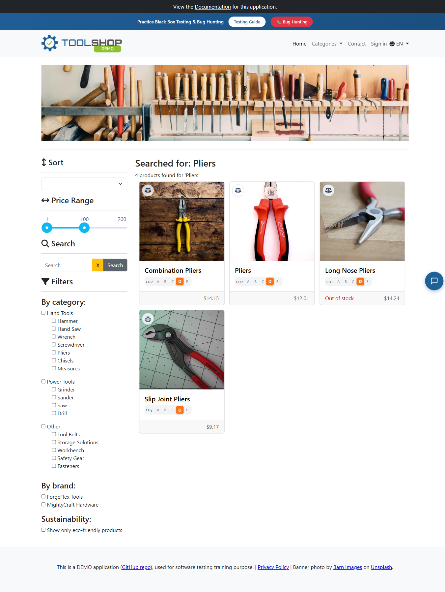
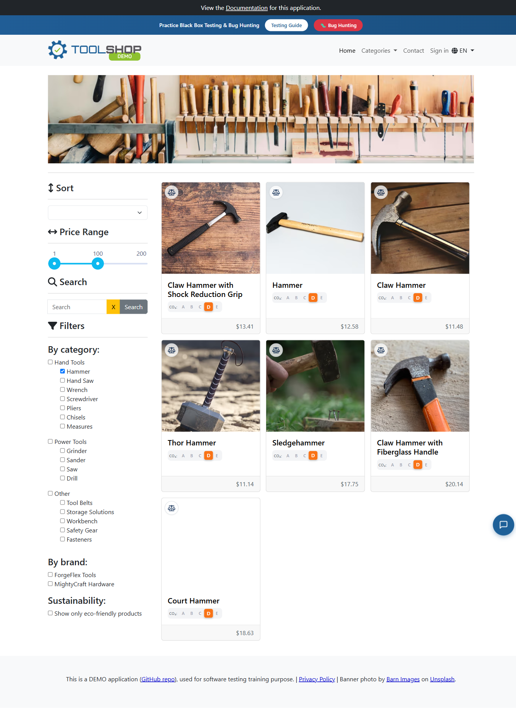
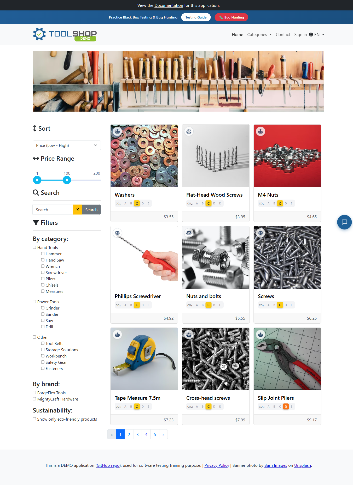
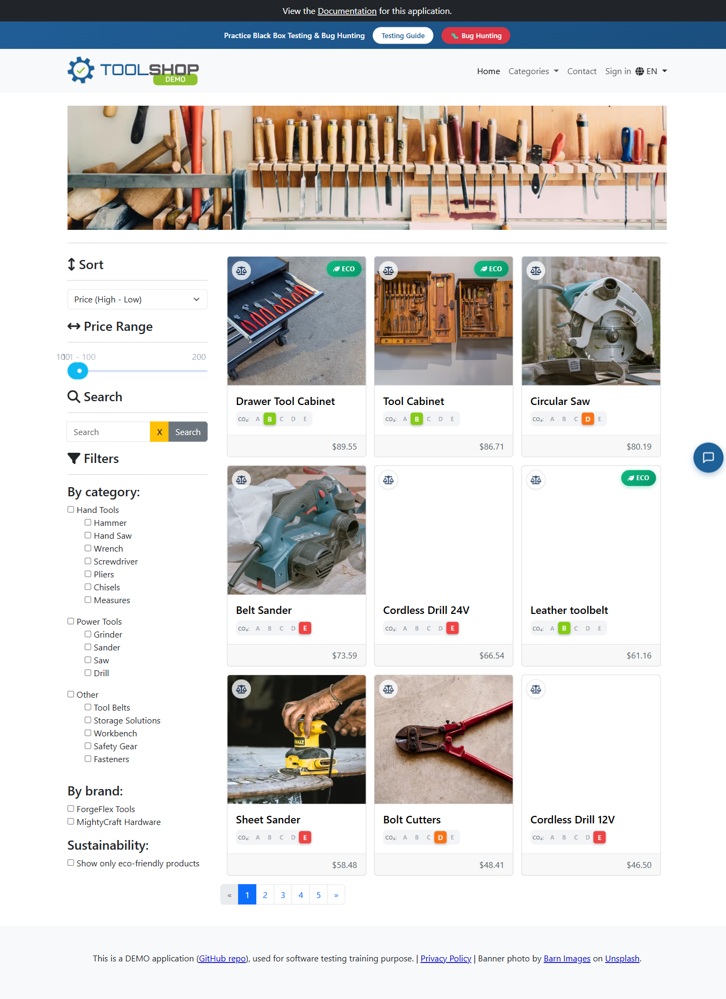
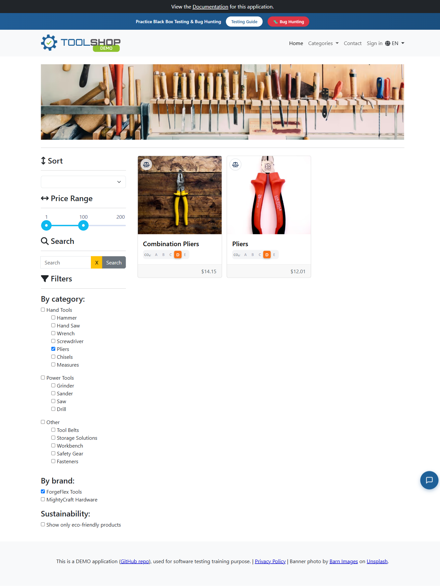
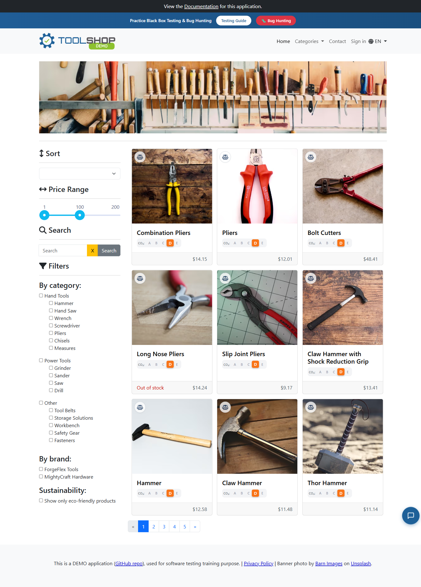
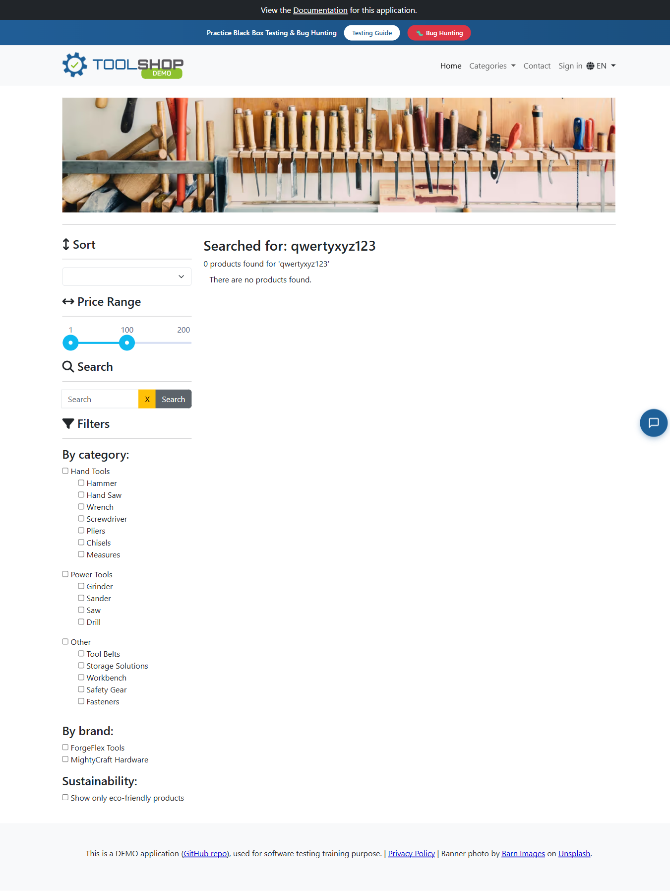

# HF1 – Tesztdokumentáció

**Alkalmazás:** Practice Software Testing – Toolshop v5.0 — <https://practicesoftwaretesting.com>
**Tesztelő:** Király Éva
**Dátum:** 2026-06-30
**Beadandó fájl:** [Kiraly_Eva_HF1.json](Kiraly_Eva_HF1.json)

> **User story:** „Vevőként szeretném a termékeket név szerint keresni, kategória és márka szerint szűrni, valamint ár szerint rendezni, hogy gyorsan megtaláljam a számomra releváns szerszámot."

> **Megjegyzés:** A kurzus beadási követelménye kizárólag a `.json` fájl, amelynek `dokumentacio` mezője a rövid (150–1000 karakteres) dokumentáció. Ez a Markdown a részletes, képernyőképes változat – a JSON kiegészítése, a munka bizonyítékaival.

---

## 1. Tesztelési scope

**Lefedett funkciók (a terméklista oldalon):**
- Keresés termék **névre**.
- Szűrés **kategóriára** és **márkára**, valamint több szűrő **együttes (AND)** alkalmazása.
- **Ár szerinti rendezés** növekvő és csökkenő irányban.
- **Üres találat** (nincs eredmény) kezelése.
- Szűrők **törlése / visszaállítása**.
- Kereső input **határesetei**: kis-/nagybetű, vezető/záró szóköz.

**Nem része a tesztelésnek (out of scope):** kosár és pénztár (checkout), bejelentkezés/regisztráció, fizetés, admin felület, termékrészletek oldal, teljesítmény-, biztonsági- és reszponzivitás-tesztelés.

---

## 2. Megközelítés

- **Fekete dobozos**, **acceptance criteria-alapú** funkcionális tesztelés a **valós (éles)** alkalmazáson.
- Teszttípusok a feladat szerint: **`happy_path`**, **`edge_case`**, **`boundary`**, **`negative`** (összesen 8 eset).
- **Automatizált végrehajtás** valódi böngészőben: a teszteket [Playwright](e2e/tests/toolshop.spec.js) hajtja végre a telepített **Google Chrome**-ban, az oldal valós `data-test` selectorjaira építve.
- A „szűrés szűkít" feltételt nem egyetlen oldal alapján, hanem a backend válaszában visszaadott **teljes találatszám (`total`)** mezőből ellenőrizzük (megbízhatóbb, mint a látható 9 elem/oldal).

---

## 3. Tesztkörnyezet

| Elem | Érték |
|------|-------|
| Cél alkalmazás | practicesoftwaretesting.com – Toolshop **v5.0** |
| Böngésző | Google **Chrome 149.0.7827.200** |
| Automatizálás | **Playwright 1.61.1** (`@playwright/test`), `channel: chrome`, látható (headed) mód, `slowMo: 450ms` |
| Futtatókörnyezet | Node.js **v24.17.0**, Windows 11 |
| Futás dátuma | 2026-06-30 |
| **Végeredmény** | **8 / 8 teszteset sikeres** (≈ 1,6 perc) |

A teljes katalógus a futás idején: **45 termék**, **5 oldal** (oldalanként 9).

---

## 4. Tesztesetek és eredmények

| ID | Típus | Lefedett acceptance criteria | Eredmény |
|----|-------|------------------------------|:--------:|
| TC01 | happy_path | Keresés névre szűkít | ✅ |
| TC02 | happy_path | Kategória szűrő szűkít | ✅ |
| TC03 | happy_path | Ár szerinti rendezés (növekvő) | ✅ |
| TC04 | happy_path | Ár szerinti rendezés (csökkenő) | ✅ |
| TC05 | edge_case | Kategória + márka együtt (AND) | ✅ |
| TC06 | edge_case | Szűrők törölhetők / visszaállíthatók | ✅ |
| TC07 | boundary | Keresés kis-/nagybetű + szóköz | ✅ |
| TC08 | negative | Nincs találat → üres állapot | ✅ |

---

### TC01 — Keresés termék névre `[happy_path]`

- **Előfeltétel:** Kezdőoldal betöltve (45 termék), nincs aktív szűrő.
- **Lépések:**
  1. Nyisd meg a kezdőoldalt.
  2. Kattints a keresőmezőbe.
  3. Írd be: `Pliers`.
  4. Nyomd meg a Search gombot.
- **Elvárt eredmény:** A lista csak a névben „Pliers"-t tartalmazó termékekre szűkül.
- **Tényleges eredmény:** 4 találat – *Combination Pliers, Pliers, Long Nose Pliers, Slip Joint Pliers* – mind tartalmazza a keresett szót. **✅ PASS**



---

### TC02 — Szűrés kategóriára (Hammer) `[happy_path]`

- **Előfeltétel:** Kezdőoldal, nincs aktív szűrő.
- **Lépések:**
  1. Nyisd meg a kezdőoldalt.
  2. A „By category" szűrőben keresd meg a Hammer kategóriát.
  3. Jelöld be a Hammer jelölőnégyzetet.
  4. Várd meg a lista frissülését.
- **Elvárt eredmény:** Csak Hammer kategóriájú termékek; a találatszám kevesebb a teljes 45-nél.
- **Tényleges eredmény:** 7 találat (`total=7` < 45): *Claw Hammer with Shock Reduction Grip, Hammer, Claw Hammer, Thor Hammer, Sledgehammer, Claw Hammer with Fiberglass Handle, Court Hammer*. **✅ PASS**



---

### TC03 — Ár szerinti rendezés, növekvő `[happy_path]`

- **Előfeltétel:** Kezdőoldal, teljes lista.
- **Lépések:**
  1. Nyisd meg a kezdőoldalt.
  2. Nyisd le a „Sort" legördülőt.
  3. Válaszd: `Price (Low - High)`.
  4. Nézd végig az árakat fentről lefelé.
- **Elvárt eredmény:** A termékek növekvő ár szerint, a legolcsóbb elöl.
- **Tényleges eredmény:** `3.55, 3.95, 4.65, 4.92, 5.55, 6.25, 7.23, 7.99, 9.17` – szigorúan nem csökkenő. **✅ PASS**



---

### TC04 — Ár szerinti rendezés, csökkenő `[happy_path]`

- **Előfeltétel:** Kezdőoldal, teljes lista.
- **Lépések:**
  1. Nyisd meg a kezdőoldalt.
  2. Nyisd le a „Sort" legördülőt.
  3. Válaszd: `Price (High - Low)`.
  4. Nézd végig az árakat, majd lapozz.
- **Elvárt eredmény:** A termékek csökkenő ár szerint, a legdrágább elöl.
- **Tényleges eredmény:** `89.55, 86.71, 80.19, 73.59, 66.54, 61.16, 58.48, 48.41, 46.50` – szigorúan nem növekvő. **✅ PASS**



---

### TC05 — Kategória ÉS márka együtt, AND `[edge_case]`

- **Előfeltétel:** Kezdőoldal, nincs aktív szűrő.
- **Lépések:**
  1. Nyisd meg a kezdőoldalt.
  2. Jelöld be a Pliers kategóriát, és jegyezd fel a találatszámot.
  3. Jelöld be a ForgeFlex Tools márkát.
  4. Várd meg a frissülést.
- **Elvárt eredmény:** Csak a Pliers **és** ForgeFlex termékek; a két szűrő együtt ≤ a kategória önmagában.
- **Tényleges eredmény:** teljes=45 → csak Pliers=5 → Pliers **ÉS** ForgeFlex=2 (*Combination Pliers, Pliers*). Az AND tovább szűkít. **✅ PASS**



---

### TC06 — Szűrők törlése és visszaállítás `[edge_case]`

- **Előfeltétel:** Kezdőoldal; a felhasználó beállít egy szűrőt.
- **Lépések:**
  1. Nyisd meg a kezdőoldalt.
  2. Jelöld be a Drill kategóriát – a lista leszűkül.
  3. Vedd ki a pipát a Drill jelölőnégyzetből.
  4. Várd meg a frissülést.
- **Elvárt eredmény:** A szűrő törlése után visszaáll a teljes lista (45 termék).
- **Tényleges eredmény:** Drill szűrővel `total=2` → szűrő törlése után `total=45`. A kiindulási állapot helyreáll. **✅ PASS**



---

### TC07 — Keresés kis-/nagybetűvel és szóközökkel `[boundary]`

- **Előfeltétel:** Kezdőoldal, teljes lista.
- **Lépések:**
  1. Nyisd meg a kezdőoldalt.
  2. Keress rá: `pliers` (csupa kisbetű), jegyezd fel a találatokat.
  3. Töröld, majd keress: `PLIERS` (csupa nagybetű).
  4. Töröld, majd keress vezető/záró szóközzel: `  Pliers  `.
- **Elvárt eredmény:** Mindhárom keresés ugyanazt adja (kis-/nagybetűre érzéketlen, szóközöket trimmeli).
- **Tényleges eredmény:** Mindhárom esetben azonos lista: *Combination Pliers, Long Nose Pliers, Pliers, Slip Joint Pliers*. A keresés case-insensitive **és** trimmel. **✅ PASS**


---

### TC08 — Keresés nem létező névre `[negative]`

- **Előfeltétel:** Kezdőoldal, teljes lista.
- **Lépések:**
  1. Nyisd meg a kezdőoldalt.
  2. Kattints a keresőmezőbe.
  3. Írj be nem létező nevet: `qwertyxyz123`.
  4. Nyomd meg a Search gombot.
- **Elvárt eredmény:** Üres lista és „There are no products found." üzenet; nincs hiba.
- **Tényleges eredmény:** 0 termékkártya, megjelenik a *There are no products found.* üzenet, az app nem dob hibát. **✅ PASS**



---

## 5. Összefoglaló

A 8 teszteset **mindegyike sikeresen lefutott (8/8)** valódi Chrome böngészőben, a practicesoftwaretesting.com éles alkalmazásán. A tesztek lefedik mind az 5 acceptance criteriát: a **keresés** a névben egyezőkre szűkít (kis-/nagybetűtől és szóköztől függetlenül), a **kategória- és márkaszűrők** külön és **AND-kombinációban** is helyesen szűkítenek, az **ár szerinti rendezés** növekvő és csökkenő irányban is helyes sorrendet ad, a **szűrők törölhetők** (a teljes lista visszaáll), és a **nincs találat** állapotot a felület egyértelmű üzenettel kezeli.

**Megfigyelések a futás során:**
- A katalógus valós mérete **45 termék / 5 oldal** (nem 50/6) – a beadandó JSON ehhez igazítva.
- A keresés **kis-/nagybetűre érzéketlen** és a felesleges **szóközöket levágja** (trim).
- Funkcionális hibát nem találtunk; az app megfelel a user story és az acceptance criteria elvárásainak.

---

## Hivatkozások / újrafuttatás

- **Beadandó:** [Kiraly_Eva_HF1.json](Kiraly_Eva_HF1.json)
- **Tesztkód:** [e2e/tests/toolshop.spec.js](e2e/tests/toolshop.spec.js) · **Konfiguráció:** [e2e/playwright.config.js](e2e/playwright.config.js)
- **Képernyőképek:** [e2e/screenshots/](e2e/screenshots/)
- **Interaktív HTML riport:**
  ```powershell
  cd c:\_git\homeworks\HF1\e2e
  npx playwright show-report
  ```
- **Tesztek újrafuttatása:**
  ```powershell
  cd c:\_git\homeworks\HF1\e2e
  npx playwright test
  ```
